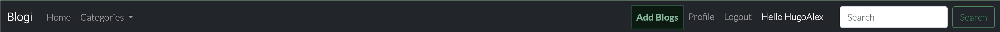
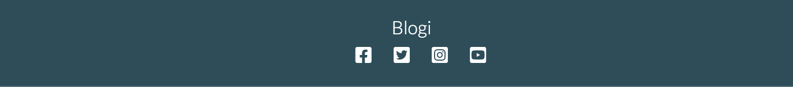
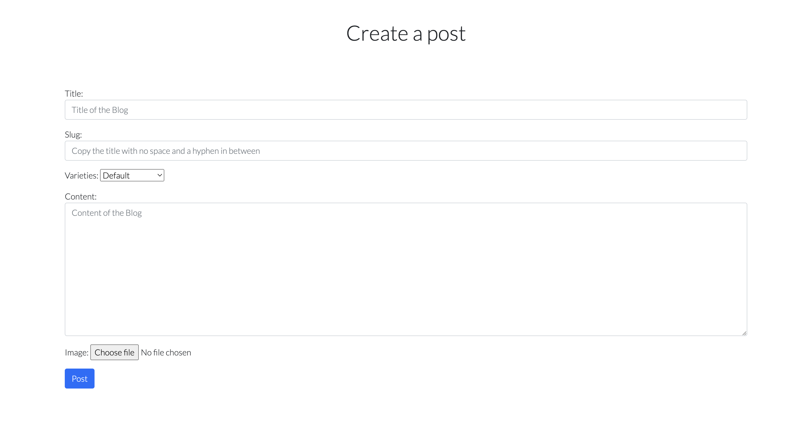

# Blogi

Welcome,

This project is created for users to share their experiences in the world. Are you traveling, hiking, partying or other activities? You are free to share it with friends, family or anyone by introducing them to this website.
On our website you can like and comment on your posts and other people posts. You can also update your image and details.

[Live project here](https://blogi-177f0953c4d1.herokuapp.com)

## Table of Contents

- [Blogi](#blogi)
  - [Table of Contents](#table-of-contents)
  - [User Experience](#user-experience)
    - [User Stories](#user-stories)
    - [Admin Stories](#admin-stories)
  - [Planning](#planning)
  - [Featues](#featues)
  - [Future Features](#future-features)
  - [Testing](#testing)

## User Experience

### User stories

As a user I would like to be able to...

- View the list of posts so that I can select one to read
  
- Click on a post and read the full text

- View the number of likes on each post so that i can see which is the most popular or most viral

- View comments on an individual post so that i can read conversations

- Register an account to be able to like and comment

- Make a post on any topic

- Manage my post. I can edit, update or delete my post

- Create profile and view other users profile

- Edit and update my profile

### Admin stories

As an admin I would like to be able to...

- Create, read, update and delete posts so that i can manage the blog contents

- Create draft posts so that i can finish writing the content later

- Approve or disapprove comments so that i can filter our objectionable comments

- View the number of likes on each post so that i can see which is the most popular or most viral

- View comments on an individual post so that i can read the conversation

- Delete a post from the home page when i am signed in

## Planning

* Colour Scheme
  * Simple colour scheme was used during the development of this project
  * Constrting colours for easy legibility and style
  Colour scheme used are:
  #212529 
  #234E5A 
  #107C7C 
  #3FAA85 
  #F9FAFC 
  #ff0000

* Fonts used are Roboto and Lato. Sans-serif was used as an alternative

* Pages were planned out on [Figma](https://www.figma.com) using wireframes

## Featues

* Logo
  * The logo is a simple word which demonstrates the intent of the website
  * The logo serves as a link to return to the home page
  
  

* Base Template

  * Header with navigation bar and search
  

  * The navigation bar contains the links:
    * The logo - This the logo of the site owner. The logo also serves as a link to return a user back to home page
    * Home - The home link redirects the user back to the home page
    * Add Blogs - This button gives the registered user the ability to add their posts
    * Hello User - This displays the name of the registered user
    * Profile - This redirects the user to the user's profile page
    * Logout - This button logs out the user
    * Search - The search provides the ability for a user to search for a post by topic

  * Footer with social media links
  

* Home Page
  * Introduction telling you about the site and what to do

  

  * List of Posts to be selected from
  * Posts are ordered by the newly posted
  * On each post are the title, the author's name, the date and time of post, the content of the post.
  Also, there are two buttons that displays the ability to like and comment on a post. It shows the counts on likes and comments.
  Still on each post there is a readmore button that redirects the visitor or user to another page where the full post is displayed.
  * Pagination - The post list is paginated when more than six post loaded on page

  

* Post Detail Page
  * The detail page displays the title at the top of the page
  * There is a profile pics of the post's author, the name and also the date and time of posts. From the author's name links a user to the author's profile page
  * By the right of the page, a registerd user can access a blue and red buttons for editing and deleting posts respectively
  * Then there is the post's image which relates to the post
  * After the image there is the content.
  * Below the content a registered user can like and comment on a post

  

* Create a post
  * Title - The form to create the post provides an input that takes the title of the posts
  * Slug - This input requests the user to copy the title and paste here since this will be used in the url to represent the post
  * Content - This takes the content of the blog from the user
  * Image - This provides the ability for the user to upload an image
  * Post button - This submits the post to the database as well as displays post on home page

  

* Profile
  * On the profile page there is an image holder for the user's profile photo.
  * Then there is a list of the user's details
  * There is an edit button that enables the users to edit and update their profiles

  

* Update profile
  Users can edit and update their profile

  

* User's Profile
  Both registered and unregistered user can access profiles

  

* When a user or admin intends to delete posts, the user will be asked to be sure before deleting

* Account pages

  * Login logout and signup pages connected with allauth

* Messages

  * Review submission, sign in and out message confirmation
  * Times out after 2.5 seconds

### Future Features

* Users will be able to have list of categories to select from while posting
