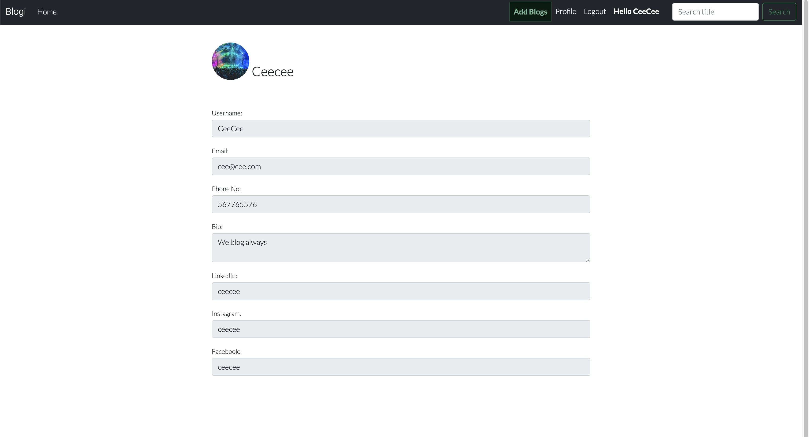

# Blogi

Welcome,

This project is created for users to share their experiences in the world. Are you traveling, hiking, partying or other activities? You are free to share it with friends, family or anyone by introducing them to this website.
On our website you can like and comment on your posts and other people posts. You can also update your image and details.

[Live project here](https://blogi-177f0953c4d1.herokuapp.com)

## Table of Contents

- [Blogi](#blogi)
  - [Table of Contents](#table-of-contents)
  - [User Experience](#user-experience)
    - [Strategy](#strategy)
    - [User Stories](#user-stories)
    - [Admin Stories](#admin-stories)
    - [Agile Methodology](#agile-methodology)
    - [Scope](#scope)
  - [Design](#design)
    - [Colors](#colors)
    - [Typography](#typography)
    - [Wireframes](#wireframes)
  - [Features](#features)
    - [Home Page](#home-page)
    - [Sign Up Page](#sign-up-page)
    - [Log In Page](#log-in-page)
    - [Log Out Page](#log-out-page)
    - [Create Post](#create-post-page)
    - [Post Detail Page](#post-detail-page)
    - [Create Profile](#create-profile-page)
    - [Profile Page](#profile-page)
    - [Edit Profile](#edit-profile-page)
    - [User Profile](#user-profile-page)
  - [Messages and Interactions With Users](#messages-and-interactions)
    - [Sign In](#sign-in)
    - [Sign Out Warning](#sign-out-warning)
    - [Sign Out](#sign-out)
    - [Search a Title](#search-title)
    - [Post Created](#post-created)
    - [Update Post](#update-post-success)
    - [Delete Post](#delete-post)
    - [Delete Post Successfully](#delete-post-success)
    - [Update Profile](#update-profile-success)
  - [Admin Panel/Superuser](#admin-panel)
  - [Future Features](#future-features)
  - [Testing](#testing)

## User Experience

### Strategy
This site was created respecting the Five Planes Of Website Design:

### User stories

As a user I would like to be able to...

- View the list of posts so that I can select one to read
  
- Click on a post and read the full text

- View the number of likes on each post so that i can see which is the most popular or most viral

- View comments on an individual post so that i can read conversations

- Register an account to be able to like and comment

- Make a post on any topic

- Manage my post. I can edit, update or delete my post

- Create profile and view other users profile

- Edit and update my profile

### Admin stories

As an admin I would like to be able to...

- Create, read, update and delete posts so that i can manage the blog contents

- Create draft posts so that i can finish writing the content later

- Approve or disapprove comments so that i can filter our objectionable comments

- View the number of likes on each post so that i can see which is the most popular or most viral

- View comments on an individual post so that i can read the conversation

- Delete a post from the home page when i am signed in

### Agile Methodology

This project was developed using the Agile methodology.
All epics and user stories implementation progress was registered using Github. As the user stories were accomplished,
they were moved in the Github board from To Do, to in-progress and Done lists.

### Scope
Create a website for the owner and users.

Project Objectives:
- To create a website with a simple and intuitive User Experience;
- To add content that is relevant and helps create a better image of the owner of the website and the users as well;
- To differentiate between users and staff members accounts;
- To implement fully functional features that will make users achieve their goals of sharing ideas and reacting to other users posts;
- To make the website available and functional on every device.

## Design

### Colors
* Colour Scheme
  * Simple colour scheme was used during the development of this project
  * Constrting colours for easy legibility and style
  Colour scheme used are:
  
  

### Typography
* Fonts used are Roboto and Lato. Sans-serif was used as an alternative

### Wireframes
* Pages were planned out on [Figma](https://www.figma.com) using wireframes

## Features
### Home Page

  * The navigation bar contains the links
    
    * The logo - This the logo of the site owner. The logo also serves as a link to return a user back to home page
    * Home - The home link redirects the user back to the home page
    * Add Blogs - This button gives the registered user the ability to add their posts
    * Hello User - This displays the name of the registered user
    * Profile - This redirects the user to the user's profile page
    * Logout - This button logs out the user
    * Search - The search provides the ability for a user to search for a post by title

  * Introduction telling you about the site and what to do
  

  * List of Posts to be selected from
    
    * Posts are ordered by the newly posted
    * On each post are the title, the author's name, the date and time of post, the content of the post.
    Also, there are two buttons that displays the ability to like and comment on a post. It shows the counts on likes and comments.
    Still on each post there is a readmore button that redirects the visitor or user to another page where the full post is displayed.
    * Pagination - The post list is paginated when more than six post loaded on page

  * Footer with social media links
  
  * The footer links the user to the listed social media platforms
  * The redirected social media websites open on a new tab

### Sign Up

  * The sign up page takes the username, the email(optional) and the password
  * Validates the inputs against the below instructions
  * Registers the new user to the database
  * And automatically builds an initial profile with the provide information

  * Your password can't be too similar to your other personal information.
  * Your password must contain at least 8 characters.
  * Your password can't be a commonly used password.
  * Your password can't be entirely numeric. 

### Log In

  * Throws an error when a user inputs the wrong username and password

### Create Post

  * Title - The form to create the post provides an input that takes the title of the posts
  * Slug - This input requests the user to copy the title and paste here since this will be used in the url to represent the post
  * Content - This takes the content of the blog from the user
  * Image - This provides the ability for the user to upload an image
  * Post button - This submits the post to the database as well as displays post on home page

### Post Detail Page

  * The detail page displays the title at the top of the page
  * There is a profile pics of the post's author, the name and also the date and time of posts. From the author's name links a user to the author's profile page
  * By the right of the page, a registerd user can access a blue and red buttons for editing and deleting posts respectively
  * Then there is the post's image which relates to the post
  * After the image there is the content.
  * Below the content a registered user can like and comment on a post

### Create Profile

  * When users click on profile they will be directed to the profile page
  * The profile page displays the initial profile created automatically during sign up
  * When the edit profile button is clicked the user will be redirected to a page with an editable form

### Profile

  * On the profile page there is an image holder for the user's profile photo.
  * Then there is a list of the user's details
  * There is an edit button that enables the users to edit and update their profiles

### Edit Profile

  * Users can edit and update their profile
  * The editable form gets the info available in the database and displays it

### User Profile

  * Both registered and unregistered user can access other users' profiles
  * From the post details page a user can click the name or profile image of the post author to access author's profile.

## Messages and Interactions With Users
### Sign In
* When a user searches for a title that is not among the listed posts

### Sign Out Warning
* When users intend to sign out of their account they receive a warning message

### Sign Out
* When users sign out of their account they receive a confirmation message

### Search a Title
* When a user searches for a title that is not among the listed posts

### Post Created
* When users create a post they receive a successful message

### Update Post
* When users update their post they receive a successful message

### Delete Post
* When a user or admin intends to delete posts, the user will be asked to be sure before deleting

### Delete Post Successfully
* When a user or admin successfully deletes a post, they get a confirmation message

### Update Profile
* When a user searches for a title that is not among the listed posts

## Admin Panel/Superuser

* On the Admin Panel, as an admin/superuser I have full access to CRUD functionality so I can view, create, edit and
delete the following ones:
1. Posts
2. Comments
3. Author
4. Categories
5. Profiles

* As admin/superuser I can also approve comments, approve posts and change the status and give other permissions to the users. 

## Technologies Used

### Languages Used

* [HTML 5](https://en.wikipedia.org/wiki/HTML/)
* [CSS 3](https://en.wikipedia.org/wiki/CSS)
* [JavaScript](https://www.javascript.com/)
* [Django](https://www.python.org/)
* [Python](https://www.djangoproject.com/)

#### Django Packages

* [Gunicorn](https://gunicorn.org/) 
   As the server for Heroku
* [Cloudinary](https://cloudinary.com/) 
   Was used to host the static files and media
* [Dj_database_url](https://pypi.org/project/dj-database-url/) 
   To parse the database URL from the environment variables in Heroku
* [Psycopg2](https://pypi.org/project/psycopg2/) 
   As an adaptor for Python and PostgreSQL databases
* [Summernote](https://summernote.org/) 
   As a text editor
* [Allauth](https://django-allauth.readthedocs.io/en/latest/installation.html) 
   For authentication, registration, account
   management
* [Crispy Forms](https://django-crispy-forms.readthedocs.io/en/latest/) 
   To style the forms

### Frameworks - Libraries - Programs Used

* [Bootstrap](https://getbootstrap.com/) 
   Was used to style the website, add responsiveness and interactivity
* [Jquery](https://jquery.com/) 
   All the scripts were written using jquery library
* [Git](https://git-scm.com/) 
   Git was used for version control by utilizing the Gitpod terminal to commit to Git and push to GitHub
* [GitHub](https://github.com/) 
   GitHub is used to store the project's code after being pushed from Git
* [Heroku](https://id.heroku.com) 
   Heroku was used to deploy the live project
* [PostgreSQL](https://www.postgresql.org/) 
   Database used through heroku.
* [VSCode](https://code.visualstudio.com/) 
   VSCode was used to create and edit the website
* [Lucidchart](https://lucid.app/) 
   Lucidchart was used to create the database diagram
* [PEP8](http://pep8online.com/) 
   PEP8 was used to validate all the Python code
* [W3C - HTML](https://validator.w3.org/) 
   W3C- HTML was used to validate all the HTML code
* [W3C - CSS](https://jigsaw.w3.org/css-validator/) 
   W3C - CSS was used to validate the CSS code
* [Fontawesome](https://fontawesome.com/) 
   To add icons to the website
* [Google Chrome Dev Tools](https://developer.chrome.com/docs/devtools/) 
   To check App responsiveness and debugging
* [Google Fonts](https://fonts.google.com/) 
   To add the 2 fonts that were used throughout the project
* [Balsamiq](https://balsamiq.com/) 
   To build the wireframes for the project
* [PIXLR](https://pixlr.com) 
   To convert the images to webp format
* [figma](https://www.figma.com/) 
   To build the logos for the project
* [Coolors](https://coolors.co/) 
   To build the colour palette of the project

### Contents
* The contents of the posts were generated from [Open AI](https://www.openai.com) 
* All images were gotten from [Unsplash](https://www.unsplash.com)

## Testing
Back to the [README](README.md)

* Testing has taken place continuously throughout the development of the project. Each view was tested regularly. 
  When the outcome was not as expected, debugging took place at that point.

### Python Validation - PEP8
* Python testing was done using the PEP8 Online to ensure there were no syntax errors in the project. All python files
were entered into the online checker and no errors were found in any of the custom codes.

## Deployment
### Deploy on Heroku
 1. Create Pipfile 
 
 In the terminal enter the command ` pip3 freeze > requirements.txt`, and a file with all requirements will be created. 
 
 2. Setting up Heroku

    * Go to the Heroku website (https://www.heroku.com/) 
    * Login to Heroku and choose *Create App* 
    * Click *New* and *Create a new app*
    * Choose a name and select your location
    * Go to the *Resources* tab 
    * From the Resources list select *Heroku Postgres*
    * Navigate to the *Deploy* tab
    * Click on *Connect to Github* and search for your repository
    * Navigate to the *Settings* tab
    * Reveal Config Vars and add your Cloudinary, Database URL (from Heroku-Postgres) and Secret key.    

3. Deployment on Heroku

    * Go to the Deploy tab.
    * Choose the main branch for deploying and enable automatic deployment 
    * Select manual deploy for building the App 
    
### Fork the repository
For creating a copy of the repository on your account and change it without affecting the original project, use<b>Fork</b> directly from GitHub:
- On [My Repository Page](https://github.com/chikadim/blogi), press <i>Fork</i> in the top right of the page
- A forked version of my project will appear in your repository  

### Clone the repository
For creating a clone of the repository on your local machine, use<b>Clone</b>:
- On [My Repository Page](https://github.com/chikadim/blogi), click the <i>Code</i> green button, right above the code window
- Chose from <i>HTTPS, SSH and GitClub CLI</i> format and copy (preferably <i>HTTPS</i>)
- In your <i>IDE</i> open <i>Git Bash</i>
- Enter the command <code>git clone</code> followed by the copied URL
- Your clone was created

## Credits

### Code
* Code Institute tutorials
* [Stack overflow](https://www.stackoverflow.com)
* [More inspiration](https://data-flair.training)
