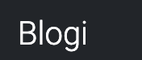
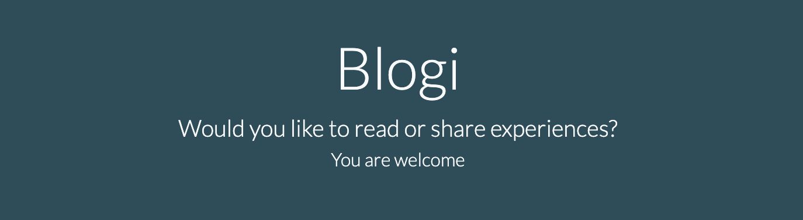

# Blogi

Welcome,

This project is created for users to share their experiences in the world. Are you traveling, hiking, partying or other activities? You are free to share it with friends, family or anyone by introducing them to this website.
On our website you can like and comment on your posts and other people posts. You can also update your image and details.

[Live project here](https://blogi-177f0953c4d1.herokuapp.com)

## Table of Contents

- [Blogi](#blogi)
  - [Table of Contents](#table-of-contents)
  - [User Experience](#user-experience)
    - [User stories](#user-stories)
    - [Admin stories](#admin-stories)
  - [Planning](#planning)
  - [Featues](#featues)

## User Experience

### User stories

As a user I would like to be able to...

- View the list of posts so that I can select one to read
  
- Click on a post and read the full text

- View the number of likes on each post so that i can see which is the most popular or most viral

- View comments on an individual post so that i can read conversations

- Register an account to be able to like and comment

- Make a post on any topic

- Manage my post. I can edit, update or delete my post

- Create profile and view other users profile

- Edit and update my profile

### Admin stories

As an admin I would like to be able to...

- Create, read, update and delete posts so that i can manage the blog contents

- Create draft posts so that i can finish writing the content later

- Approve or disapprove comments so that i can filter our objectionable comments

- View the number of likes on each post so that i can see which is the most popular or most viral

- View comments on an individual post so that i can read the conversation

- Delete a post from the home page when i am signed in

## Planning

* Colour Scheme
  * Simple colour scheme was used during the development of this project
  * Constrting colours for easy legibility and style
  Colour scheme used are:
  #212529 
  #234E5A 
  #107C7C 
  #3FAA85 
  #F9FAFC 
  #ff0000

* Fonts used are Roboto and Lato. Sans-serif was used as an alternative

* Pages were planned out on [Figma](https://www.figma.com) using wireframes

## Featues

* Logo
  * The logo is a simple word which demonstrates the intent of the website
  * The logo serves as a link to return to the home page
  
  

* Base Template

  * Header with navigation bar and search
  

  * Footer with social media links
  

* Index Page
  * Introduction telling you about the site and what to do

  
