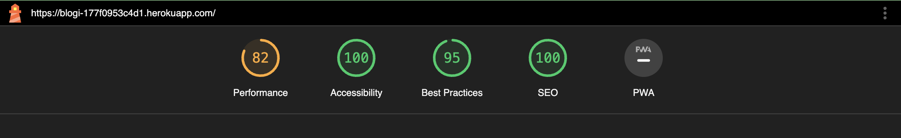

## Testing
[Go Back to README](README.md)

Testing took place continuously throughout the development of the project. Each view was tested regularly. 
When the outcome was not as expected, debugging took place at that point.

## Python Validation - pythonchecker.com, pylance and flake8
* Python testing was done using the pylance and Flake8 extensions on vscode to ensure there were no syntax errors in the project. 
* All python files were entered into the online checker and no errors were found in any of the custom codes.

### Blogi - home

* [admin.py](./assets/readme/test/admin_error.png) - Few errors were found
* [admin.py](./assets/readme/test/admin_fixed.png) - Fixed
  1. A line of Python code should not be longer than 79 characters!
  2. Add two empty lines in front of function definition.
  3. Put whitespaces around the operators (+-*/==....)

* [apps.py](./assets/readme/test/apps.png) - No errors were found

* [models.py](./assets/readme/test/model_error.png) - Few errors were found
* [models.py](./assets/readme/test/fixed.png) - Fixed

* [forms.py](./assets/readme/test/forms_error.png) - Few errors were found
* [forms.py](./assets/readme/test/fixed.png) - Fixed

* [urls.py](./assets/readme/test/urls_error.png) - Few errors were found
* [urls.py](./assets/readme/test/fixed.png) - Fixed

* [views.py](./assets/readme/test/views_error.png) - Few errors were found
* [views.py](./assets/readme/test/fixed.png) - Fixed

* [context_processors.py](./assets/readme/test/fixed.png) - No errors were found

### Blogi - postdetails
* [admin.py](./assets/readme/test/fixed.png) - No errors were found
* [apps.py](./assets/readme/test/fixed.png) - No errors were found
* [models.py](./assets/readme/test/fixed.png) - No errors were found
* [urls.py](./assets/readme/test/fixed.png) - No errors were found
* [views.py](./assets/readme/test/fixed.png) - No errors were found

### Blogi - blogi
* [asgi.py](./assets/readme/test/fixed.png) - No errors were found
* [settings.py](./assets/readme/test/fixed.png) - No errors were found
* A few errors were raised in the blogi/settings.py file, however these were related to default django authorisation code and could not be changed to remove the errors.
* [urls.py](./assets/readme/test/fixed.png) - No errors were found
* [wsgi.py](./assets/readme/test/fixed.png) - No errors were found
* [manage.py](./assets/readme/test/fixed.png) - No errors were found

## Lighthouse
Lighthouse was used to test Performance, Best Practices, Accessibility and SEO on Desktop.
* 