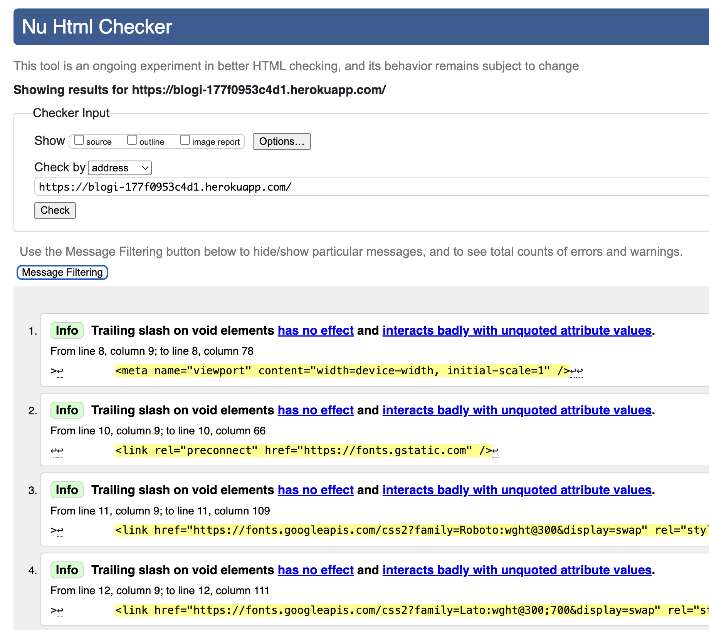
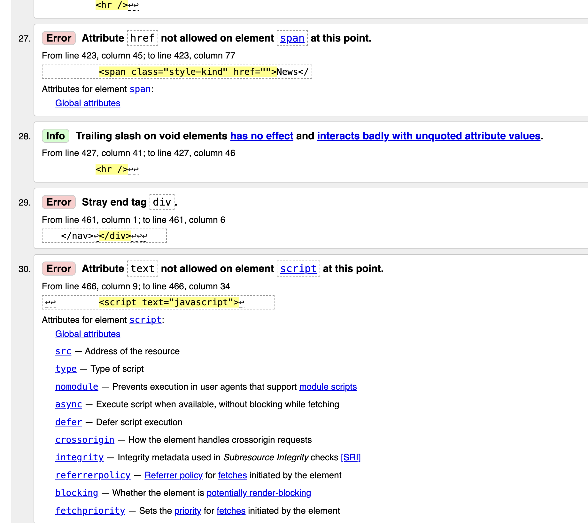
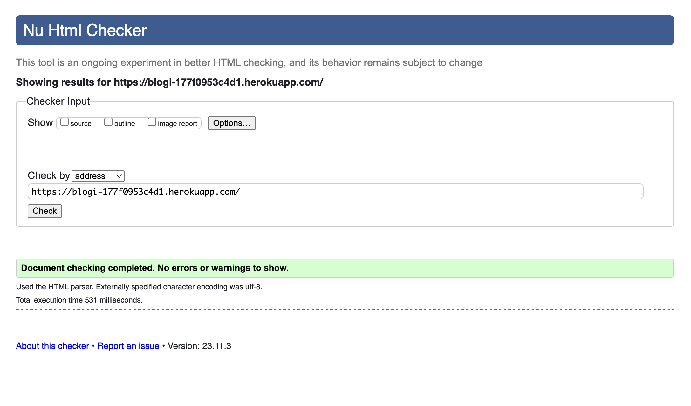
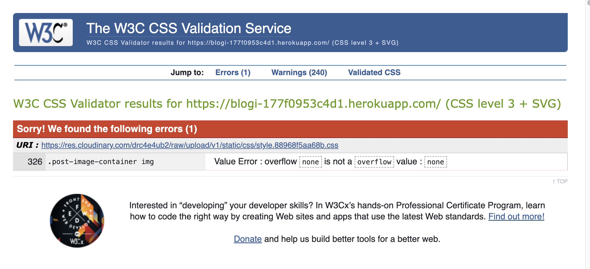
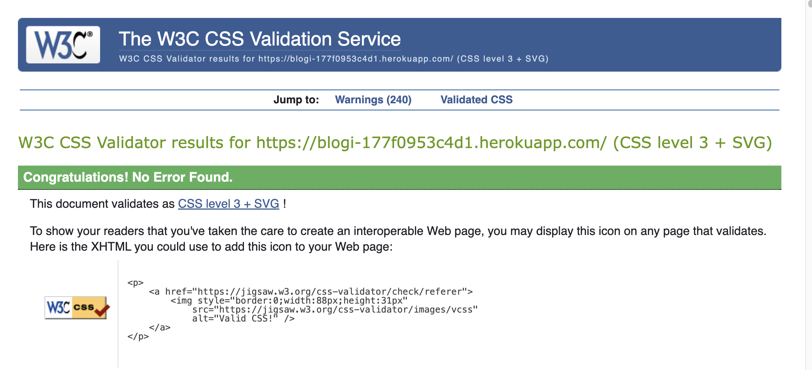

## Testing
[Go Back to README](README.md)

Testing took place continuously throughout the development of the project. Each view was tested regularly. 
When the outcome was not as expected, debugging took place at that point.

## Python Validation - pythonchecker.com, pylance and flake8
* Python testing was done using the pylance and Flake8 extensions on vscode to ensure there were no syntax errors in the project. 
* All python files were entered into the online checker and no errors were found in any of the custom codes.

### Blogi - home

* [admin.py](./assets/readme/test/admin_error.png) - Few errors were found
* [admin.py](./assets/readme/test/admin_fixed.png) - Fixed
  1. A line of Python code should not be longer than 79 characters!
  2. Add two empty lines in front of function definition.
  3. Put whitespaces around the operators (+-*/==....)

* [apps.py](./assets/readme/test/apps.png) - No errors were found

* [models.py](./assets/readme/test/model_error.png) - Few errors were found
* [models.py](./assets/readme/test/fixed.png) - Fixed

* [forms.py](./assets/readme/test/forms_error.png) - Few errors were found
* [forms.py](./assets/readme/test/fixed.png) - Fixed

* [urls.py](./assets/readme/test/urls_error.png) - Few errors were found
* [urls.py](./assets/readme/test/fixed.png) - Fixed

* [views.py](./assets/readme/test/views_error.png) - Few errors were found
* [views.py](./assets/readme/test/fixed.png) - Fixed

* [context_processors.py](./assets/readme/test/fixed.png) - No errors were found

### Blogi - postdetails
* [admin.py](./assets/readme/test/fixed.png) - No errors were found
* [apps.py](./assets/readme/test/fixed.png) - No errors were found
* [models.py](./assets/readme/test/fixed.png) - No errors were found
* [urls.py](./assets/readme/test/fixed.png) - No errors were found
* [views.py](./assets/readme/test/fixed.png) - No errors were found

### Blogi - blogi
* [asgi.py](./assets/readme/test/fixed.png) - No errors were found
* [settings.py](./assets/readme/test/fixed.png) - No errors were found
* A few errors were raised in the blogi/settings.py file, however these were related to default django authorisation code and could not be changed to remove the errors.
* [urls.py](./assets/readme/test/fixed.png) - No errors were found
* [wsgi.py](./assets/readme/test/fixed.png) - No errors were found
* [manage.py](./assets/readme/test/fixed.png) - No errors were found

## Lighthouse
Lighthouse was used to test Performance, Best Practices, Accessibility and SEO on Desktop.
* 

## HTML Validation
HTML was validated using Validator.w3.org and 30 errors were found

 

Fixed

## CSS Validation
CSS was validated using jigsaw.w3.org and 1 error was found

 

Fixed

## Manual Testing
### Frontend
* The Signup, Login and Logout system has no issues and is working accordingly. It shows the right 
  interactive message to the users.
* The Profile Page is working properly. It updates the user information and uploads/updates the 
  user profile image. It shows the interactive message to the user once the update is complete.
* The user profile image in the Post Details page has no issues and shows the user image 
  when it is uploaded by the user on the Profile Page.
* All the internal links are working and bring the user to the right page on the website.
* All the external links are working and bring the user to the right social media page by 
  opening a new browser tab.
* The Categories Page shows the categories filtered by category without issues.
* The drop-down menu in the navbar shows a list of categories on every page of the website.
* The pagination system is working. It adds another page after 9 posts on the page.
* On the Post Details Page, the Like/unlike functionality is working without issues
* The comment form has no issues and it submits a new comment once the form is completed by a
  registered user. 
  The comment is displayed once the submit button is pressed. The two interactive messages for 
  this action are working without errors. 
* The functionality to delete a post, previously done by the user or by the superuser, is 
  working without issues. The delete warning opens to ask the user if they want to delete 
  the message. Once the action is complete, the interactive message is displayed at the top of the page.
* On the post details Page, the CRUD functionality is working without issues. Logged in users can create a new 
  post such as update or delete their own posts, also any post can be updated or deleted on this page by the Superuser.
* On the post list Page, the superuser can delete any post

### Backend/Admin Panel
* I have tested the Admin Panel repeatedly since the start of the project development. All the models are working without issues.  
  I have created, deleted, and updated data in all models without errors. The models have the behavior expected for what they were built for.
* Whenever a user comments on a post the Superuser has to approve it before it will be displayed on the website. This functionality is working without issues.
* When the user is making a new post all the required fields have to be filled otherwise the user can't submit the post to the database.